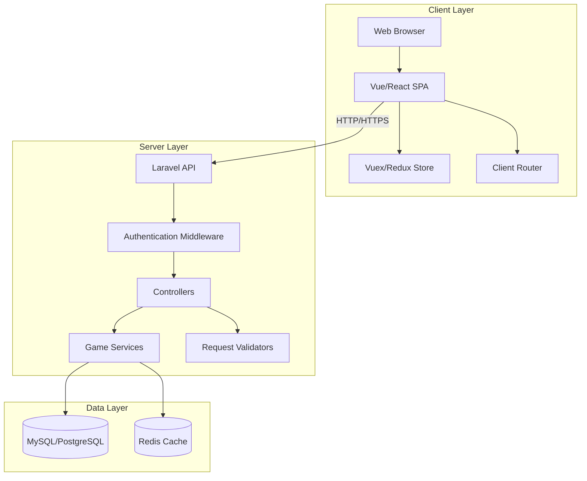
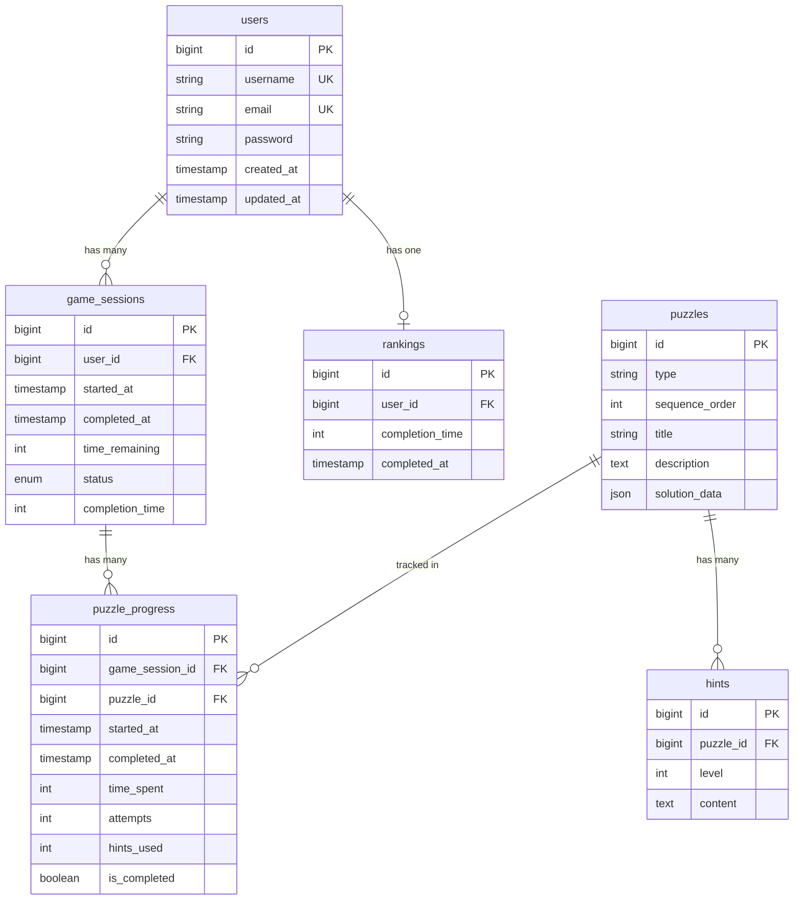

# Design Document: Lovecraftian Escape Room

## Overview

Este documento describe el diseño técnico de una aplicación web de escape room con temática lovecraftiana. El sistema está compuesto por un backend Laravel que gestiona la lógica de negocio, autenticación, sesiones de juego y persistencia de datos, y un frontend moderno (Vue.js o React) que proporciona una interfaz inmersiva y responsive.

La arquitectura sigue un patrón cliente-servidor con comunicación RESTful API. El backend maneja toda la validación crítica de puzzles y progreso del juego para prevenir manipulación del cliente. El frontend gestiona el estado de la UI, animaciones, multimedia y la experiencia de usuario interactiva.

El juego consiste en una secuencia de 10 puzzles que el jugador debe resolver dentro de un límite de tiempo de 25 minutos. El sistema incluye un temporizador en tiempo real, sistema de pistas progresivas, cinemáticas narrativas, y un ranking global que motiva la competencia entre jugadores.

## Architecture

### System Architecture



### Technology Stack

**Backend:**
- Framework: Laravel 10.x
- Language: PHP 8.1+
- Database: MySQL 8.0 or PostgreSQL 14+
- Cache: Redis (optional, for session management and ranking cache)
- Authentication: Laravel Sanctum for SPA authentication

**Frontend:**
- Framework: Vue.js 3.x (Composition API) or React 18.x (Hooks)
- State Management: Pinia (Vue) or Redux Toolkit (React)
- Routing: Vue Router or React Router
- HTTP Client: Axios
- Build Tool: Vite
- Styling: Tailwind CSS + custom CSS for lovecraftian theme

**Development & Deployment:**
- Version Control: Git
- Package Manager: Composer (backend), npm/yarn (frontend)
- Testing: PHPUnit (backend), Vitest/Jest (frontend)
- Property Testing: Pest with Faker (backend), fast-check (frontend)

### Communication Flow

1. **Authentication Flow:**
   - User submits credentials → Frontend validates format → API validates credentials → Laravel Sanctum issues token → Frontend stores token → Subsequent requests include token

2. **Game Session Flow:**
   - Player starts game → API creates Game_Session record → Frontend initializes timer → Timer decrements client-side → Every 30s sync with backend → Actions validated server-side

3. **Puzzle Interaction Flow:**
   - Player submits solution → Frontend sends to API → Backend validates solution → Backend updates progress → Backend returns result → Frontend updates UI and unlocks next puzzle

## Components and Interfaces

### Backend Components

#### 1. Authentication Module

**Responsibilities:**
- User registration with validation
- User login with credential verification
- Password hashing and verification
- Session/token management
- CSRF protection
- Rate limiting

**Key Classes:**
- `AuthController`: Handles registration and login endpoints
- `User` (Model): Eloquent model for users table
- `RegisterRequest`: Form request validator for registration
- `LoginRequest`: Form request validator for login

**API Endpoints:**
```
POST /api/register
POST /api/login
POST /api/logout
GET /api/user
```

#### 2. Game Session Module

**Responsibilities:**
- Create and manage game sessions
- Track timer state
- Enforce single active session per user
- Handle game over and victory states
- Record completion times

**Key Classes:**
- `GameSessionController`: Manages session lifecycle
- `GameSession` (Model): Eloquent model for game_sessions table
- `GameSessionService`: Business logic for session management
- `TimerService`: Handles timer calculations and validation

**API Endpoints:**
```
POST /api/game/start
GET /api/game/session
POST /api/game/sync
POST /api/game/complete
POST /api/game/abandon
```

#### 3. Puzzle Module

**Responsibilities:**
- Serve puzzle data
- Validate puzzle solutions
- Track puzzle progress
- Unlock sequential puzzles
- Record time per puzzle

**Key Classes:**
- `PuzzleController`: Handles puzzle interactions
- `Puzzle` (Model): Eloquent model for puzzles table
- `PuzzleProgress` (Model): Tracks user progress on puzzles
- `PuzzleValidatorService`: Contains validation logic for each puzzle type
- `PuzzleFactory`: Creates puzzle instances with randomized parameters

**API Endpoints:**
```
GET /api/puzzles/{sessionId}
POST /api/puzzles/{puzzleId}/submit
GET /api/puzzles/{puzzleId}/progress
```

**Puzzle Types (10 total):**
1. **Symbol Cipher**: Decode lovecraftian symbols to reveal a word
2. **Ritual Pattern**: Arrange ritual items in correct sequence
3. **Ancient Lock**: Solve a combination based on clues in the environment
4. **Memory Fragments**: Match pairs of eldritch imagery
5. **Cosmic Alignment**: Align celestial bodies to match a star chart
6. **Tentacle Maze**: Navigate through a shifting maze avoiding tentacles
7. **Forbidden Tome**: Reconstruct torn pages of an ancient book in correct order
8. **Shadow Reflection**: Mirror movements to match shadow patterns on the wall
9. **Cultist Code**: Decode intercepted messages using frequency analysis
10. **Elder Sign Drawing**: Trace complex geometric patterns without lifting the cursor

#### 4. Hint Module

**Responsibilities:**
- Track time spent on each puzzle
- Determine hint availability
- Serve progressive hints
- Limit hints per puzzle

**Key Classes:**
- `HintController`: Manages hint requests
- `Hint` (Model): Eloquent model for hints table
- `HintService`: Business logic for hint availability and progression

**API Endpoints:**
```
GET /api/puzzles/{puzzleId}/hints/available
GET /api/puzzles/{puzzleId}/hints/{level}
```

#### 5. Ranking Module

**Responsibilities:**
- Maintain global leaderboard
- Update rankings on completion
- Keep best time per user
- Provide real-time rank updates

**Key Classes:**
- `RankingController`: Serves ranking data
- `Ranking` (Model): Eloquent model for rankings table
- `RankingService`: Business logic for ranking calculations and updates

**API Endpoints:**
```
GET /api/ranking/top
GET /api/ranking/user/{userId}
```

### Frontend Components

#### 1. Authentication Components

**Components:**
- `LoginForm.vue/jsx`: Login form with validation
- `RegisterForm.vue/jsx`: Registration form with validation
- `AuthLayout.vue/jsx`: Layout wrapper for auth pages

**State:**
- `user`: Current authenticated user object
- `isAuthenticated`: Boolean authentication status
- `authToken`: API authentication token

#### 2. Game Components

**Components:**
- `GameBoard.vue/jsx`: Main game container
- `Timer.vue/jsx`: Countdown timer display
- `PuzzleContainer.vue/jsx`: Renders current puzzle
- `HintPanel.vue/jsx`: Displays available hints
- `ProgressIndicator.vue/jsx`: Shows puzzle completion progress
- `GameOver.vue/jsx`: Game over screen
- `Victory.vue/jsx`: Victory screen with completion time

**State:**
- `gameSession`: Current session data
- `currentPuzzle`: Active puzzle object
- `timeRemaining`: Seconds remaining
- `puzzlesCompleted`: Array of completed puzzle IDs
- `hintsUsed`: Map of puzzle ID to hints used

#### 3. Puzzle Components

Each puzzle type has its own component:
- `SymbolCipher.vue/jsx`
- `RitualPattern.vue/jsx`
- `AncientLock.vue/jsx`
- `MemoryFragments.vue/jsx`
- `CosmicAlignment.vue/jsx`
- `TentacleMaze.vue/jsx`
- `ForbiddenTome.vue/jsx`
- `ShadowReflection.vue/jsx`
- `CultistCode.vue/jsx`
- `ElderSignDrawing.vue/jsx`

**Common Interface:**
```typescript
interface PuzzleComponent {
  puzzleData: PuzzleData;
  onSubmit: (solution: any) => void;
  onHintRequest: () => void;
  disabled: boolean;
}
```

#### 4. Ranking Components

**Components:**
- `Leaderboard.vue/jsx`: Displays top 100 players
- `UserRank.vue/jsx`: Shows current user's rank
- `RankingEntry.vue/jsx`: Individual ranking row

#### 5. Multimedia Components

**Components:**
- `Cinematic.vue/jsx`: Video/animation player for story sequences
- `AmbientAudio.vue/jsx`: Background sound manager
- `SoundEffects.vue/jsx`: Plays action-triggered sounds
- `AnimatedBackground.vue/jsx`: Lovecraftian cave environment

### Interface Contracts

#### API Response Format

All API responses follow this structure:

```json
{
  "success": true,
  "data": {},
  "message": "Operation successful",
  "errors": []
}
```

#### WebSocket Events (Optional Enhancement)

For real-time ranking updates:
```
Event: ranking.updated
Payload: { userId, username, completionTime, rank }
```

## Data Models

### Database Schema

#### users
```sql
CREATE TABLE users (
  id BIGINT UNSIGNED PRIMARY KEY AUTO_INCREMENT,
  username VARCHAR(50) UNIQUE NOT NULL,
  email VARCHAR(255) UNIQUE NOT NULL,
  password VARCHAR(255) NOT NULL,
  created_at TIMESTAMP DEFAULT CURRENT_TIMESTAMP,
  updated_at TIMESTAMP DEFAULT CURRENT_TIMESTAMP ON UPDATE CURRENT_TIMESTAMP,
  INDEX idx_email (email),
  INDEX idx_username (username)
);
```

#### game_sessions
```sql
CREATE TABLE game_sessions (
  id BIGINT UNSIGNED PRIMARY KEY AUTO_INCREMENT,
  user_id BIGINT UNSIGNED NOT NULL,
  started_at TIMESTAMP NOT NULL,
  completed_at TIMESTAMP NULL,
  time_remaining INT NOT NULL DEFAULT 1500,
  status ENUM('active', 'completed', 'abandoned', 'timeout') DEFAULT 'active',
  completion_time INT NULL,
  created_at TIMESTAMP DEFAULT CURRENT_TIMESTAMP,
  updated_at TIMESTAMP DEFAULT CURRENT_TIMESTAMP ON UPDATE CURRENT_TIMESTAMP,
  FOREIGN KEY (user_id) REFERENCES users(id) ON DELETE CASCADE,
  INDEX idx_user_status (user_id, status),
  INDEX idx_status (status)
);
```

#### puzzles
```sql
CREATE TABLE puzzles (
  id BIGINT UNSIGNED PRIMARY KEY AUTO_INCREMENT,
  type VARCHAR(50) NOT NULL,
  sequence_order INT NOT NULL,
  title VARCHAR(255) NOT NULL,
  description TEXT NOT NULL,
  solution_data JSON NOT NULL,
  created_at TIMESTAMP DEFAULT CURRENT_TIMESTAMP,
  updated_at TIMESTAMP DEFAULT CURRENT_TIMESTAMP ON UPDATE CURRENT_TIMESTAMP,
  INDEX idx_sequence (sequence_order)
);
```

#### puzzle_progress
```sql
CREATE TABLE puzzle_progress (
  id BIGINT UNSIGNED PRIMARY KEY AUTO_INCREMENT,
  game_session_id BIGINT UNSIGNED NOT NULL,
  puzzle_id BIGINT UNSIGNED NOT NULL,
  started_at TIMESTAMP NOT NULL,
  completed_at TIMESTAMP NULL,
  time_spent INT DEFAULT 0,
  attempts INT DEFAULT 0,
  hints_used INT DEFAULT 0,
  is_completed BOOLEAN DEFAULT FALSE,
  created_at TIMESTAMP DEFAULT CURRENT_TIMESTAMP,
  updated_at TIMESTAMP DEFAULT CURRENT_TIMESTAMP ON UPDATE CURRENT_TIMESTAMP,
  FOREIGN KEY (game_session_id) REFERENCES game_sessions(id) ON DELETE CASCADE,
  FOREIGN KEY (puzzle_id) REFERENCES puzzles(id) ON DELETE CASCADE,
  UNIQUE KEY unique_session_puzzle (game_session_id, puzzle_id),
  INDEX idx_session (game_session_id)
);
```

#### hints
```sql
CREATE TABLE hints (
  id BIGINT UNSIGNED PRIMARY KEY AUTO_INCREMENT,
  puzzle_id BIGINT UNSIGNED NOT NULL,
  level INT NOT NULL,
  content TEXT NOT NULL,
  created_at TIMESTAMP DEFAULT CURRENT_TIMESTAMP,
  updated_at TIMESTAMP DEFAULT CURRENT_TIMESTAMP ON UPDATE CURRENT_TIMESTAMP,
  FOREIGN KEY (puzzle_id) REFERENCES puzzles(id) ON DELETE CASCADE,
  UNIQUE KEY unique_puzzle_level (puzzle_id, level)
);
```

#### rankings
```sql
CREATE TABLE rankings (
  id BIGINT UNSIGNED PRIMARY KEY AUTO_INCREMENT,
  user_id BIGINT UNSIGNED NOT NULL,
  completion_time INT NOT NULL,
  completed_at TIMESTAMP NOT NULL,
  created_at TIMESTAMP DEFAULT CURRENT_TIMESTAMP,
  updated_at TIMESTAMP DEFAULT CURRENT_TIMESTAMP ON UPDATE CURRENT_TIMESTAMP,
  FOREIGN KEY (user_id) REFERENCES users(id) ON DELETE CASCADE,
  UNIQUE KEY unique_user_ranking (user_id),
  INDEX idx_completion_time (completion_time)
);
```

### Entity Relationships



### Data Transfer Objects (DTOs)

#### GameSessionDTO
```typescript
interface GameSessionDTO {
  id: number;
  userId: number;
  startedAt: string;
  timeRemaining: number;
  status: 'active' | 'completed' | 'abandoned' | 'timeout';
  currentPuzzleId: number | null;
  puzzlesCompleted: number;
  totalPuzzles: number;
}
```

#### PuzzleDTO
```typescript
interface PuzzleDTO {
  id: number;
  type: string;
  sequenceOrder: number;
  title: string;
  description: string;
  data: any; // Puzzle-specific data
  isCompleted: boolean;
  timeSpent: number;
  hintsAvailable: number;
  hintsUsed: number;
}
```

#### RankingEntryDTO
```typescript
interface RankingEntryDTO {
  rank: number;
  userId: number;
  username: string;
  completionTime: number; // in seconds
  completedAt: string;
}
```


## Correctness Properties

A property is a characteristic or behavior that should hold true across all valid executions of a system-essentially, a formal statement about what the system should do. Properties serve as the bridge between human-readable specifications and machine-verifiable correctness guarantees.

### Property 1: Valid Registration Creates Account

For any valid registration data (unique email, unique username, password meeting requirements), submitting the registration should result in a new user account being created in the database with a hashed password.

**Validates: Requirements 1.2**

### Property 2: Invalid Registration Returns Errors

For any invalid registration data (duplicate email, duplicate username, weak password, missing fields), submitting the registration should return descriptive validation errors and not create an account.

**Validates: Requirements 1.3**

### Property 3: Valid Login Creates Session

For any valid login credentials (existing email and correct password), submitting the login should create an authenticated session with a valid token.

**Validates: Requirements 1.6**

### Property 4: Invalid Login Returns Error

For any invalid login credentials (non-existent email, incorrect password), submitting the login should return an authentication error and not create a session.

**Validates: Requirements 1.7**

### Property 5: Rate Limiting Blocks Brute Force

For any user account, after N failed login attempts within a time window, subsequent login attempts should be blocked with a rate limit error.

**Validates: Requirements 1.9**

### Property 6: Game Start Creates Session

For any authenticated user without an active session, starting a new game should create a Game_Session record with status 'active' and a countdown timer.

**Validates: Requirements 2.1**

### Property 7: Initial Timer Value

For any newly created Game_Session, the initial timer value should be exactly 1500 seconds (25 minutes).

**Validates: Requirements 2.2**

### Property 8: Timer Decrements Over Time

For any active Game_Session, after N seconds have elapsed, the time_remaining should have decreased by N seconds.

**Validates: Requirements 2.3**

### Property 9: Single Active Session Per User

For any user, attempting to start a new game while having an active Game_Session should either fail with an error or abandon the previous session and create a new one, ensuring only one active session exists.

**Validates: Requirements 2.9**

### Property 10: Game Over Prevents Interactions

For any Game_Session in 'timeout' or 'game_over' status, attempting to submit puzzle solutions should be rejected with an appropriate error.

**Validates: Requirements 2.6**

### Property 11: Completion Triggers Victory

For any active Game_Session, when all puzzles are marked as completed and time remains, the session status should transition to 'completed' and trigger victory state.

**Validates: Requirements 2.7**

### Property 12: Victory Records Completion Time

For any Game_Session that reaches 'completed' status, the completion_time field should be populated with the time taken (initial_time - time_remaining).

**Validates: Requirements 2.8**

### Property 13: Sequential Puzzle Presentation

For any Game_Session, puzzles should be presented in ascending order by their sequence_order field, with puzzle N+1 only accessible after puzzle N is completed.

**Validates: Requirements 3.2**

### Property 14: Puzzle Completion Unlocks Next

For any puzzle in a Game_Session, when a correct solution is submitted, the puzzle should be marked as completed (is_completed = true) AND the next puzzle in sequence should become accessible.

**Validates: Requirements 3.3, 3.5**

### Property 15: Incorrect Solution Provides Feedback

For any puzzle and any incorrect solution, submitting the solution should return feedback indicating it's incorrect without revealing the correct answer, and the puzzle should remain incomplete.

**Validates: Requirements 3.4**

### Property 16: Puzzle Time Tracking

For any puzzle being attempted in a Game_Session, the system should track and update the time_spent field in puzzle_progress, reflecting the elapsed time since the puzzle was started.

**Validates: Requirements 3.6, 4.1**

### Property 17: Hint Availability After Timeout

For any puzzle in progress, if the time_spent exceeds 120 seconds (2 minutes) without completion, at least one hint should become available for that puzzle.

**Validates: Requirements 4.2**

### Property 18: Maximum Hints Per Puzzle

For any puzzle, the system should provide at most 3 hints, and requesting a hint beyond the third should be rejected or return no additional hints.

**Validates: Requirements 4.5**

### Property 19: Completion Adds to Ranking

For any user who completes a Game_Session, their completion_time should be added to the rankings table, creating a new ranking entry or updating their existing entry if the new time is better.

**Validates: Requirements 5.1, 5.5**

### Property 20: Ranking Sorted by Time

For any query to the rankings, the results should be ordered by completion_time in ascending order (fastest times first).

**Validates: Requirements 5.2**

### Property 21: Ranking Top 100 Limit

For any query to the global rankings, the system should return at most 100 entries.

**Validates: Requirements 5.3**

### Property 22: Ranking Entry Completeness

For any entry in the rankings, it should contain the user's username and their completion_time.

**Validates: Requirements 5.4**

### Property 23: Best Time Only in Ranking

For any user who completes the game multiple times, only their best (lowest) completion_time should be stored in the rankings table.

**Validates: Requirements 5.6**

### Property 24: User Rank Calculation

For any user in the rankings, their rank position should equal the count of users with better (lower) completion_time plus one.

**Validates: Requirements 5.7**

### Property 25: Request Validation

For any API endpoint, submitting a request with invalid data (wrong types, missing required fields, out-of-range values) should return a validation error response and not process the request.

**Validates: Requirements 8.3**

### Property 26: Protected Routes Require Authentication

For any protected API endpoint, submitting a request without a valid authentication token should return a 401 Unauthorized error.

**Validates: Requirements 8.6**

### Property 27: Data Persistence Round Trip

For any user, game session, or ranking data created through the API, querying the database should return the same data that was submitted (round trip property).

**Validates: Requirements 8.7**

### Property 28: Password Encryption with Bcrypt

For any password submitted during registration, the stored password in the database should be encrypted using bcrypt with a cost factor of at least 10, and should not match the plaintext password.

**Validates: Requirements 1.4, 10.1**

### Property 29: XSS Input Sanitization

For any user input containing potential XSS payloads (script tags, event handlers, javascript: URLs), the system should sanitize the input before storage or display, preventing script execution.

**Validates: Requirements 10.3**

### Property 30: Server-Side Game Validation

For any game action (puzzle submission, hint request, session completion), the validation and state changes should occur on the backend, and client-side manipulation should not affect the server state.

**Validates: Requirements 10.6**

### Property 31: Session Timeout After Inactivity

For any authenticated session, if no requests are made for 2 hours (7200 seconds), subsequent requests should fail with a session expired error.

**Validates: Requirements 10.7**

### Property 32: Authentication Attempt Logging

For any login or registration attempt (successful or failed), the system should create a log entry recording the attempt with timestamp, user identifier, and result.

**Validates: Requirements 10.8**

## Error Handling

### Error Categories

**1. Validation Errors (400 Bad Request)**
- Invalid input format
- Missing required fields
- Data type mismatches
- Business rule violations (e.g., duplicate username)

Response format:
```json
{
  "success": false,
  "message": "Validation failed",
  "errors": {
    "field_name": ["Error message 1", "Error message 2"]
  }
}
```

**2. Authentication Errors (401 Unauthorized)**
- Invalid credentials
- Missing authentication token
- Expired session
- Invalid token

Response format:
```json
{
  "success": false,
  "message": "Authentication required",
  "errors": ["Invalid or expired token"]
}
```

**3. Authorization Errors (403 Forbidden)**
- Attempting to access another user's game session
- Insufficient permissions

Response format:
```json
{
  "success": false,
  "message": "Access denied",
  "errors": ["You do not have permission to access this resource"]
}
```

**4. Not Found Errors (404 Not Found)**
- Resource doesn't exist
- Invalid puzzle ID
- User not found

Response format:
```json
{
  "success": false,
  "message": "Resource not found",
  "errors": ["The requested resource does not exist"]
}
```

**5. Rate Limiting Errors (429 Too Many Requests)**
- Too many login attempts
- API rate limit exceeded

Response format:
```json
{
  "success": false,
  "message": "Rate limit exceeded",
  "errors": ["Too many attempts. Please try again in X minutes"]
}
```

**6. Server Errors (500 Internal Server Error)**
- Database connection failures
- Unexpected exceptions
- Third-party service failures

Response format:
```json
{
  "success": false,
  "message": "An unexpected error occurred",
  "errors": ["Please try again later"]
}
```

### Error Handling Strategy

**Backend:**
- Use Laravel's exception handler to catch and format all exceptions
- Log all errors with appropriate severity levels (debug, info, warning, error, critical)
- Never expose sensitive information (stack traces, database details) in production
- Use database transactions for multi-step operations to ensure atomicity
- Implement retry logic for transient failures (database deadlocks, network timeouts)
- Validate all inputs at the controller level using Form Requests
- Use custom exception classes for domain-specific errors

**Frontend:**
- Display user-friendly error messages for all error types
- Show loading states during API calls to prevent duplicate submissions
- Implement exponential backoff for retrying failed requests
- Handle network errors gracefully (offline mode, connection lost)
- Validate inputs client-side for immediate feedback (but always validate server-side)
- Log errors to a monitoring service (e.g., Sentry) for debugging
- Provide fallback UI for critical failures (e.g., game state recovery)

### Critical Error Scenarios

**1. Timer Desynchronization**
- Problem: Client timer drifts from server timer
- Solution: Sync with server every 30 seconds, use server time as source of truth
- Recovery: If desync detected, update client timer to match server

**2. Lost Game Session**
- Problem: User loses connection during active game
- Solution: Store session ID in localStorage, allow session recovery
- Recovery: On reconnect, check for active session and restore state

**3. Puzzle Submission During Timeout**
- Problem: User submits solution as timer reaches zero
- Solution: Backend validates time_remaining before accepting submission
- Recovery: Reject submission, return game over state

**4. Concurrent Session Creation**
- Problem: User opens multiple tabs and starts game in both
- Solution: Database constraint ensures one active session per user
- Recovery: Latest session creation abandons previous session

## Testing Strategy

### Dual Testing Approach

This project requires both unit testing and property-based testing to ensure comprehensive coverage:

**Unit Tests** focus on:
- Specific examples and edge cases
- Integration points between components
- Error conditions and boundary values
- UI component rendering and interactions

**Property-Based Tests** focus on:
- Universal properties that hold for all inputs
- Comprehensive input coverage through randomization
- Invariants and business rules
- Round-trip properties (serialization, parsing)

Both testing approaches are complementary and necessary. Unit tests catch concrete bugs and verify specific behaviors, while property tests verify general correctness across a wide range of inputs.

### Backend Testing

**Framework:** PHPUnit with Pest for property-based testing

**Property-Based Testing Library:** Pest with Faker for data generation

**Configuration:**
- Each property test must run minimum 100 iterations
- Each test must reference its design document property in a comment
- Tag format: `// Feature: lovecraftian-escape-room, Property {number}: {property_text}`

**Test Categories:**

1. **Unit Tests:**
   - Model methods and relationships
   - Service class methods
   - Validation rules
   - Helper functions
   - Specific edge cases (empty inputs, boundary values)

2. **Property-Based Tests:**
   - Authentication properties (Properties 1-5, 28)
   - Game session properties (Properties 6-12)
   - Puzzle system properties (Properties 13-18)
   - Ranking properties (Properties 19-24)
   - Security properties (Properties 25-32)

3. **Integration Tests:**
   - API endpoint responses
   - Database transactions
   - Middleware behavior
   - Authentication flow

4. **Feature Tests:**
   - Complete game flow from start to finish
   - User registration and login flow
   - Ranking updates after completion

**Example Property Test Structure:**

```php
// Feature: lovecraftian-escape-room, Property 1: Valid Registration Creates Account
test('valid registration creates account with hashed password', function () {
    // Run 100 iterations with random valid data
    expect(fn() => [
        'username' => fake()->unique()->userName(),
        'email' => fake()->unique()->safeEmail(),
        'password' => fake()->password(8, 20),
    ])
    ->sequence(100)
    ->each(function ($data) {
        $response = $this->postJson('/api/register', $data);
        
        $response->assertStatus(201);
        
        $user = User::where('email', $data['email'])->first();
        expect($user)->not->toBeNull();
        expect($user->username)->toBe($data['username']);
        expect($user->password)->not->toBe($data['password']); // Hashed
        expect(Hash::check($data['password'], $user->password))->toBeTrue();
    });
});
```

### Frontend Testing

**Framework:** Vitest (Vue) or Jest (React)

**Property-Based Testing Library:** fast-check

**Configuration:**
- Each property test must run minimum 100 iterations
- Each test must reference its design document property in a comment
- Tag format: `// Feature: lovecraftian-escape-room, Property {number}: {property_text}`

**Test Categories:**

1. **Unit Tests:**
   - Component rendering
   - Event handlers
   - Computed properties / derived state
   - Utility functions
   - Specific user interactions

2. **Property-Based Tests:**
   - State management invariants
   - Timer behavior
   - Form validation
   - Data transformation functions

3. **Integration Tests:**
   - API communication
   - Route navigation
   - Authentication flow
   - Game state transitions

4. **E2E Tests (Optional):**
   - Complete user journeys
   - Cross-browser compatibility
   - Responsive design verification

**Example Property Test Structure:**

```typescript
// Feature: lovecraftian-escape-room, Property 8: Timer Decrements Over Time
import fc from 'fast-check';

test('timer decrements correctly over time', () => {
  fc.assert(
    fc.property(
      fc.integer({ min: 1, max: 1500 }), // initial time (25 minutes)
      fc.integer({ min: 1, max: 60 }), // elapsed seconds
      (initialTime, elapsedSeconds) => {
        const gameSession = createGameSession({ timeRemaining: initialTime });
        
        // Simulate time passing
        advanceTimerBy(elapsedSeconds);
        
        const expectedTime = Math.max(0, initialTime - elapsedSeconds);
        expect(gameSession.timeRemaining).toBe(expectedTime);
      }
    ),
    { numRuns: 100 }
  );
});
```

### Test Coverage Goals

- Backend: Minimum 80% code coverage
- Frontend: Minimum 70% code coverage
- All correctness properties must have corresponding property-based tests
- All API endpoints must have integration tests
- All critical user flows must have feature/E2E tests

### Continuous Integration

- Run all tests on every pull request
- Block merges if tests fail
- Run property tests with increased iterations (500+) on main branch
- Generate and publish coverage reports
- Run security scans (OWASP dependency check)

### Manual Testing Checklist

- [ ] Test complete game flow on desktop
- [ ] Test complete game flow on mobile
- [ ] Test all puzzle types for solvability
- [ ] Verify timer accuracy over full 20 minutes
- [ ] Test hint system progression
- [ ] Verify ranking updates correctly
- [ ] Test session recovery after disconnect
- [ ] Verify all cinematics play correctly
- [ ] Test audio playback on different devices
- [ ] Verify responsive design on various screen sizes
- [ ] Test cross-browser compatibility (Chrome, Firefox, Safari, Edge)
- [ ] Verify accessibility (keyboard navigation, screen readers)

